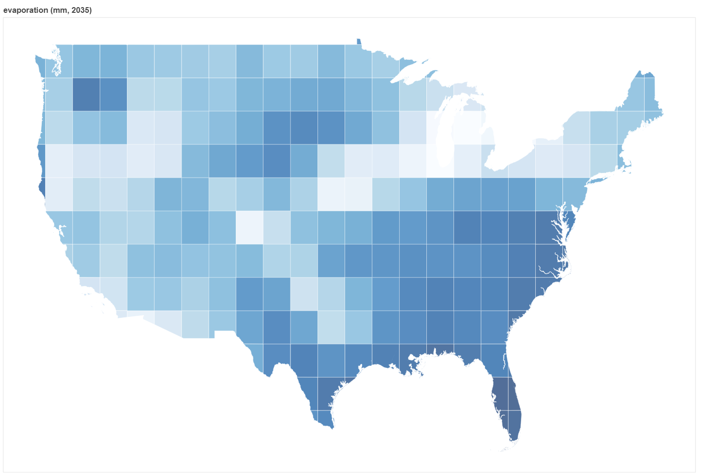

# SIMoN
System Integration with Multiscale Networks

Copyright 2020 The Johns Hopkins University Applied Physics Laboratory

Licensed under the MIT License

## Description
The SIMoN joint modeling framework integrates independently-designed predictive models into a cohesive system, in order to produce a unified model. While many useful models are limited to predicting only a single isolated component of a larger system, SIMoN is able to connect models together so that collectively they can provide a more complete representation of the global system and its dynamics.  By using the SIMoN software, a modeler is able to join these disparate models together in various combinations and find new insights in their data.

In order to translate data from its models across different geographic granularities, SIMoN uses a network graph that represents all the granularities, their corresponding entities, and their relationships to each other. The individual models feed each other updated data inputs at synchronized time intervals, and traverse the network graph to translate their data from one granularity to another. A sample granularity graph is provided, but modelers can extend it or create a graph of their own, by modifying and using the `graphs/build.py` script.

SIMoN is written in Python 3.6, and uses Docker to manage its models and their integration. Each model runs in its own separate, modular Docker container. An additional container runs the system’s centralized Broker, which receives each model’s data outputs using a PyZMQ publish-subscribe messaging pattern. The Broker then redirects the data to any models that request it. The models can then use this data as their inputs for the next incremental step in the system’s synchronized run.

## Requirements

Supported operating systems:
 - Linux
 - macOS

Software:
 - Python 3.6
 - Docker >= 18.09.6
 - Docker Compose >= 1.23.2

## Setup
SIMoN uses Docker and Compose to run its models in separate containers. To run SIMoN, clone the repo and install these tools.
* [Docker](https://docs.docker.com/install/)
* [Docker Compose](https://docs.docker.com/compose/install/)

The Docker containers used for the models are built from Ubuntu 18.04 images, with the Python 3.6 and libzmq packages layered on top.

The Docker container used for the database is a MongoDB image.

Additionally, install `make`, so that the shell commands that operate SIMoN can be executed more easily using the Makefile.

The Docker commands in the provided scripts assume that you are a privileged user. To use Docker as a non-root user, add your user to the `docker` group:
```
sudo usermod -aG docker <your_username>
```
Log out and back in for this to take effect.

## Usage
1.  Choose the models that you want to run together in the SIMoN framework. The default SIMoN configuration uses these 5 sample models:
    * population
    * power_demand
    * power_supply
    * water_demand
    * gfdl_cm3

    To use a different set of models, see the instructions on how to "Add a new model" and "Remove a model" below.

2. Optionally, adjust the models' output schemas, in order to change the granularity of their output data. The recognized granularities (all lowercase) are:
    * usa48
    * state
    * county
    * nerc
    * huc8
    * latlon
3. To start SIMoN:
    * `make all`
    * Use `docker logs broker -f` to track output from the broker container. The increment step "incstep" should increase over time as models publish their data, and the mongodb container should populate with documents (database: `broker`; collection: `sub`).
    * Use `docker logs build_your_model_name_1 -f` to track output from the model named `your_model_name`.
4.  To shut down SIMoN:
    * `make stop` to stop all the containers
    * `make clean` to stop and remove all the containers

## Visualization
SIMoN stores all of the data outputs from the models as documents in a Mongo database (the `simon_mongodb` container).

You can retrieve a document and save it as a JSON file using the `export.sh` bash script in the `viz` directory.

```
cd viz/
./export.sh <model_name> <year>
```
For example,
```
./export.sh gfdl_cm3 2035
```

Once you've retrieved a document and saved it as a JSON file, plot the data on a choropleth map using the Python script in the `viz` directory. (Just make sure to install requirements first.)
```
pip install -r requirements.txt
python plot.py <your_mongo_doc>.json
```
For example,
```
python plot.py 2025_gfdl_cm3.json
```
A new HTML file will be created in the `viz` directory. Open this file in a web browser to display the Bokeh visualization.



## Add a new model
1.  Choose the models that you want to run together in the SIMoN framework. Note their interdependencies carefully, and make sure that each model has a source for all of its necessary data inputs. Sample models are provided in the `examples` directory, where each model has its own directory. Each model's dependencies are specified in its `schemas/inputs` directory. For example, the `power_supply` model relies on the `power_demand` model, and the `power_demand` and `water_demand` models both rely on the `population` model. The `population` and `gfdl_cm3` models do not rely on any other models, and can each be run independently.
2.  Once you have a complete set of models where all dependencies are satisfied, add the unique name of each of the models to the "models" list in `broker/config.json`.
3.  Create an entry for each model in the "services" section in `build/docker-compose.yml` and specify the path to each model's directory.
    ```
    model_name_1:
        build: ../models/examples/model_name_1/
        volumes:
            - ../models/examples/model_name_1:/opt:ro
4. In the `models` directory, copy the `template` directory, which serves as a blueprint for new models. Rename `template` to the ID (unique name) of your new model.
5. Within this new directory are several required directories and files that need to be modified:
    * `src/` stores the model's source code
        * `inner_wrapper.py`
            * This file receives input data from other models, performs operations on it, and returns the output data that will be sent to other models.
            * You must replace the template name with the the model's ID (its unique name).
            * You must implement the `configure()` and `increment()` abstract methods.
                * `configure()` simply loads the initialization data from the `config` directory.
                * `increment()` performs the model's calculations by calling any of the its custom function(s) (e.g., my_function_1) defined in other scripts.
        * `my_function_1.py`
            * additional code that your model uses
        * `my_function_2.py`
            * additional code that your model uses
    * `schemas/input/` stores JSON schemas that incoming JSON data messages must validate against. SIMoN uses the `jsonschema` Python package to validate the data messages against the schemas.
	* `*.json`
        * granularity: specifies the granularity of input data that this model needs. SIMoN will translate incoming data to this granularity before sending it to the model's inner wrapper.
    * `schemas/output/` stores JSON schemas that outgoing JSON data messages must validate against. SIMoN uses the `jsonschema` Python package to validate the data messages against the schemas.
        * `*.json`
        * granularity: specifies the granularity of data that this model will output. SIMoN will translate outgoing data to this granularity after receiving it from the model's inner wrapper.
    * `config/` stores JSON objects with the initial data and parameters needed to bootstrap the model and run its first time step.
        * `*.json`

## Remove a model
1.  Before removing a model from SIMoN, make sure that no other models rely on it for their dependencies. For example, the `gfdl_cm3` model can safely be removed because no other models depend on it for their data inputs. However, the `power_demand` model cannot be removed without also removing the `power_supply` model, which relies on `power_demand` as an input.
2.  Remove the name of the model from the "models" list in `broker/config.json`.
3.  Remove the entry for the model in the "services" section of `build/docker-compose.yml`.
4.  The model will no longer be included in future SIMoN runs. Note, however, that the model's dedicated directory is left intact.
5.  To add the model back into SIMoN, simply repeat steps 2 and 3 from "Add a new model."
