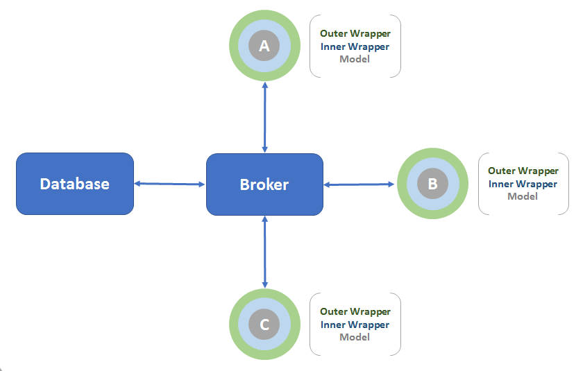

# SIMoN Architecture

## Description

SIMoN is written in Python, and uses Docker to manage its models and their integration. In order to increase flexibility and scalability, each model runs in discrete iterations (called increment steps) within its own Docker container. An additional container hosts the system's centralized Broker, which orchestrates model runs by receiving each model's data outputs via a ZeroMQ publish-subscribe messaging pattern, then redirecting the data to any models that request it with their input schemas. The models can then use this data as their inputs for the next incremental step in the system's synchronized run.

Upon the initialization of a SIMoN run, the broker publishes status messages to the models. Each model connects to the broker, bootstraps on the initialization data provided in its `config` directory, publishes its output data,  then waits for other models to do the same. Once all models have received their necessary data inputs from the published data outputs of other models (from the previous iteration), they will perform their next iteration. In this way, models will run in tandem. Once the final iteration has completed, the Broker and the model containers will close down.

The Inner Wrappers are interfaces tailored to each model, and support the models' internal logic and data calculations. The Outer Wrappers are interfaces common to each model, and support the models' connectivity to the central broker and automated data translations between geographic granularities.

## Configuration

Adjust parameters in the `build/config.json` file.

  * `mongo_port` is the port that the MongoDB container will use. The default Mongo port is 27017.
  * `boot_timer` is the number of seconds that the broker will wait for all models to initialize, before it sends the shutdown signal. Try extending this time if models will take longer to load and process their configuration data in the custom `configure()` method in their inner wrapper.
  * `watchdog_timer` is the number of seconds that the broker will wait to receive a status message from a model, before it sends the shutdown signal. If a model crashes, the broker will wait for this number of seconds before stopping the SIMoN run.
  * `max_incstep` is the number of increments that the SIMoN run should perform before closing down.
  * `initial_year` is the year corresponding to the configuration data (increment step 0).
  * `models` lists the ID / unique name of each model that will be included in the SIMoN run.

Because SIMoN runs predictive models, each increment step, and the data published at that increment step, corresponds to a point in time in the future. Currently, each increment corresponds to a year, since the data in the example models is annual. The `initial_year` parameter is used to specify the year assigned to the initial increment step 0, and translates each subsequent increment step to its corresponding year. For models that do not have annual data, the reported "year" can be ignored by the user. In the future, SIMoN may be expanded to support multiple definitions of time (such as year, month, and fiscal quarter), just like it currently supports multiple definitions of geography.
