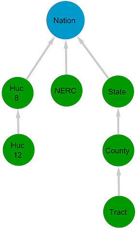

# SIMoN Granularity Graph Tool

This tool constructs the granularity graphs used for data translation in the SIMoN software application. By using SIMoN, a modeler is able to join models with disparate geographic definitions together in various combinations, allowing models to run together and exchange data that have heterogeneous definitions of geography.

## Basic Usage

This tool uses shapefiles to generate two JSON graphs: an abstract graph and an instance graph.

Run `make graph` from the top-level `simon` directory.

This will start the `simon-graph` Docker container, and create an abstract graph / instance graph pair in the `graphs/out` directory. The container will exit once the graph pair has been built. To use the generated graphs for the next SIMoN run, rename the abstract graph to abstract-graph.geojson, and the instance graph to instance-graph.geojson.

## Geographic Granularities

SIMoN currently integrates models of population, power systems, water systems, and climate change. These domains each have their own hierarchies of geography, which include political, topographical, regulatory, and latitude-longitude grid boundaries.

The supported granularities are:
  * `usa48` (a single region for the contiguous United States)
  * `state` (49 regions: the lower 48 states plus Washington, DC)
  * `county` (3108 counties, including Washington, DC)
  * `nerc` (22 North American Electric Reliability Corporation "NERC" regions)
  * `huc8` (2119 Hydrological Unit Code 8 "HUC8" watershed regions)
  * `latlon` (209 latitude-longitude grid squares)

In order to represent granularities, SIMoN uses shapefiles to define rigorous geographies in a partially ordered set of geographic partitions (e.g., states, counties, watersheds, power regions, and latitude-longitude grid squares). The sample shapefiles provided in the `graphs/shapefiles` directory were clipped to the land boundary of the contiguous United States, in order to have consistent scope. Their geometries were compressed / simplified using a distance-based method (the Douglas-Peucker algorithm) with a tolerance of 1 kilometer. They use [EPSG:3085](https://epsg.io/3085-1901) NAD83(HARN) / Texas Centric Albers Equal Area as their coordinate reference system.

## Graphs

To translate data from the models across granularities, SIMoN constructs a pair of directed acyclic network graphs, representing all the granularities, their corresponding entities, and their relationships to each other. The individual models feed each other updated data inputs at synchronized time intervals, and traverse the network graphs to translate their data from one granularity to another. A sample pair of granularity graphs is provided, but modelers can extend it or create a graph pair of their own, by modifying the `graphs/build.py` script and running `make graph`.

The abstract graph is used to define the conceptual relationships between geographic entities. The modeler defines the abstract graph using an edge list in the `graphs/config.json` file. Geographies on the same branch of the abstract graph are neatly subsumed under each other; for example, a county fits within the boundaries of exactly one state. Geographies on different branches may intersect with each other; for example, a NERC region might cross the boundaries of more than one state. Granularity graphs with HUC 12 and census tract regions are not included in the current release, but are shown here for illustration.

The instance graph is constructed from the abstract graph, using the `graphs/build.py` script and the provided shapefiles. Each vertex in the abstract graph is replaced with vertices that represent the actual instances of the conceptual geography, which are retrieved from the corresponding shapefile. For example, the `county` vertex in the abstract graph is replaced by the 3108 county regions defined in the `county.shp` shapefile. Each `county` vertex in the instance graph has a single parent, the `state` vertex that it belongs to.

## Aggregators and Disaggregators

The modeler can choose transformation functions, called aggregators and disaggregators, to translate data between compatible geographic definitions in various ways. These aggregators and disaggregators must conform to a set of mathematical axioms, including a partial inverse property, which are designed to create a provable notion of data consistency and reduce the possibility of self-propagating errors.

Aggregators are functions used to combine data from sibling vertices in the granularity graph into a value for their parent vertex. Disaggregators are functions used to distribute data from a vertex to its children.

Aggregators:
* `simple_sum`: the parent vertex's new value is the sum of its children's values.
* `simple_average`: the parent's new value is the mean of the children's values.
* `weighted_average`: the parent's new value is the mean of the children's values, weighted by each child's geographic area.

Disaggregators:
* `distribute_identically`: the parent vertex's value is assigned to each one of its children.
* `distribute_uniformly`: the parent vertex's value is divided evenly among each of its children.
* `distribute_by_area`: each child vertex is assigned a portion of the parent's value, proportional to the child's geographic area.

## Advanced Usage

Adjust these parameters in the `graphs/config.json` file:

* `projection` is the EPSG coordinate reference system code that all of the shapefile polygons will be translated to, in order to ensure consistency. For the most precise results, use the original EPSG of the shapefiles.
* `scale_factor` divides the area of each shapefile's polygons by a scalar, in order to convert units. For example, the provided shapefiles have length units of meters and area units of square meters. The default scale_factor is 1 million, in order to translate the area unit of the provided shapefiles from square meters to square kilometers. Change the scale factor to 1 to preserve the original units.
* `minimum_intersection_area` sets the minimum area of an instance wedge vertex (a vertex that results from intersecting vertices from two different branches of the granularity graph). Because of precision errors, a minimum intersection area of 0 could result in the creation of many tiny, spurious vertices that clutter the instance graph. The default minimum intersection area is set to 1 length unit, where length unit is the length unit of the shapefiles *after* any scaling from the `scale_factor` has been performed.
* `abstract_edges` is the list of edges in the abstract graph, where each edge is represented by a tuple in the form of [source, target]. Adjust the items in this list to create a new abstract graph. The `build.py` script will generate the corresponding instace graph by finding the corresponding shapefiles in the `graphs/shapefiles` directory. Each of the vertices implicitly defined by these edges must have a corresponding shapefile with the same name and the `.shp` extension.
* `save_shapes` specifies whether to create an additional, much larger instance graph file, which saves the polygon shapes of the instance graph vertices.
* `tag` is a label / suffix attached to the abstract graph and instance graph filenames.

Both JSON graphs have 3 key attributes:
* `nodes` maps to a list of the graph's vertices.
* `links` maps to a list of the graph's edges.
* `graph` maps to a dictionary of the graph's metadata.
    * `id` is a UUID for the abstract-instance graph pair, that both the abstract graph and the corresponding instance graph share.
    * `projection` is the coordinate reference system that the shapefile geometries are defined on.
    * `granularities` are the granularities that the graphs connect.
    * `min_intersect_area` is the minimum area of a wedge vertex in the instance graph (a vertex made by intersecting disparate geographic granularities).
    * `nodes` is the number of vertices in the graph.
    * `links` is the number of edges in the graph.
    * `counts` is the number of vertices in the graph, categorized by granularity.
    * `areas` is the total area of each granularity's scope, that is, the sum of all the vertex areas of each granularity. Ideally, these areas should be equal so that the graph will have a consistent scope.
