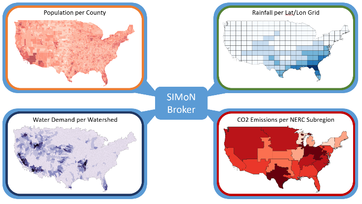

# SIMoN Models

## Description

The SIMoN framework is designed to be extensible and flexible, providing tools for modelers to integrate new models, domains, and the corresponding geographic definitions easily. It currently connects predictive resource models from several different domains, including climate, energy, water, and population. These SIMoN models are low fidelity, designed as proxies for larger, more sophisticated models to be developed by the community.



## Usage

1.  Choose the models that you want to run together in the SIMoN framework. The default SIMoN configuration uses these 5 sample models:
    * population
    * power_demand
    * power_supply
    * water_demand
    * gfdl_cm3

    For more details on these models, see "Example models" below.

    To use a different set of models, see the instructions on how to "Add a new model" and "Remove a model" below.

2. Optionally, adjust the models' output schemas, in order to change the granularity of their output data. Open the JSON file in a model's `schemas/output` directory with a text editor. Each variable in the schema has a `granularity` property. Change the `value` field of this property to one of these recognized [granularities](../graphs/README.md#granularities) (all lowercase):
    * usa48
    * state
    * county
    * nerc
    * huc8
    * latlon

You can also adjust the values of the `agg` and `dagg` properties to use different [aggregators and disaggregators](../graphs/README.md#aggregators-and-disaggregators) to perform granularity translations.

## Add a new model

1.  Choose the set of models that you want to run together in the SIMoN framework. Note their interdependencies carefully, and make sure that each model has a source for all of its necessary data inputs. Each model's dependencies must be specified in its `schemas/inputs` directory. Sample models are provided in the `examples` directory, where each model has its own directory. For example, the sample `power_supply` model relies on the `power_demand` model, and the `power_demand` and `water_demand` models both rely on the `population` model. The `population` and `gfdl_cm3` models do not rely on any other models, and can each be run independently.
2. In the `models` directory, make a copy of the `template` directory, which serves as a blueprint for new models. Rename the `template` directory to the ID (unique name) of your new model. This will be the new model's dedicated directory.
3. Within this new directory are several required directories and files that need to be modified:
    * `src/` stores the model's source code
        * `inner_wrapper.py`
            * This file receives input data from other models, performs operations on it, and returns the output data that will be sent to other models.
            * You must replace the template name with the the model's ID (its unique name).
            * You must implement the `configure()` and `increment()` abstract methods.
                * `configure()` simply loads the initialization data from the `config` directory.
                * `increment()` performs the model's calculations by calling any of the function(s) defined in its custom modules (e.g., `my_module.py`).
        * `my_module.py`
            * any additional code that your model uses
    * `schemas/input/` stores JSON schemas that incoming JSON data messages must validate against. SIMoN uses the `jsonschema` Python package to validate the data messages against the schemas. There should be one input schema JSON file for each of the other models that this model receives data from. Adjust the `granularity` property in the input schema so that the input data that arrives in the model's inner wrapper will be in the granularity that is needed for your custom `my_module` functions to work.
	* `*.json`
        * granularity: specifies the granularity of input data that this model needs. The model's outer wrapper will translate incoming data to this granularity before sending it to the model's inner wrapper. If your inner wrapper needs the data to be in a different granularity in order to work with it, adjust the granularity value in the input schema accordingly.
    * `schemas/output/` stores JSON schemas that outgoing JSON data messages must validate against. SIMoN uses the `jsonschema` Python package to validate the data messages against the schemas.
        * `*.json`
        * granularity: specifies the granularity of data that this model will output. The model's outer wrapper will translate outgoing data to this granularity after receiving it from the model's inner wrapper.
    * `config/` stores JSON objects with the initial data and parameters needed to bootstrap the model and perform the initial increment step.
        * `*.json`
4.  Once you have a complete set of models where all dependencies are satisfied, add the unique name of each of the models to the "models" list in `broker/config.json`.
5.  Create an entry for each model in the "services" section in `build/docker-compose.yml` and specify the path to each model's directory.
    ```
    model_name_1:
        build: ../models/examples/model_name_1/
        volumes:
            - ../models/examples/model_name_1:/opt:ro
    ```

## Remove a model

1.  Before removing a model from SIMoN, make sure that no other models rely on it for their dependencies. For example, the `gfdl_cm3` model can safely be removed because no other models depend on it for their data inputs. However, the `power_demand` model cannot be removed without also removing the `power_supply` model, which relies on `power_demand` as an input.
2.  Remove the name of the model from the `models` list in `broker/config.json`.
3.  Remove the entry for the model in the `services` section of `build/docker-compose.yml`.
4.  The model will no longer be included in future SIMoN runs. Note, however, that the model's dedicated directory is left intact, so that it can be added back in easily.
5.  To add the model back into SIMoN, simply repeat steps 4 and 5 from "Add a new model."

## Example models

### Population (Holt's linear fit)
The population model uses Holt's linear regression from the `statsmodel` Python package to predict population per county. It extrapolates US Census Bureau population data from 2000 to 2016 into the future, making a population prediction for each future year. The model gives more weight to the most recent historical data, so the population change from 2015 to 2016 is more significant than the change between 2000 and 2001.

Config (initialization) data: historical population per county (US Census Bureau, [2000-2010](https://www.census.gov/data/datasets/time-series/demo/popest/intercensal-2000-2010-counties.html), [2010-2016](https://www.census.gov/data/datasets/time-series/demo/popest/2010s-counties-total.html), version published in 2016).

Input from other models: none.

Output: a dictionary that maps each county FIPS code to its population.

### Power Demand
The power demand model aggregates county population to state population, then multiplies these values to the corresponding data for state consumption per capita, returning power demand per state.

Config (initialization) data: historical population (2016) per county and state consumption per capita ([US Energy Information Administration](https://www.eia.gov/electricity/data/state/)).

Input from other models: output from the population model.

Output: a dictionary that maps each county FIPS code to its power demand per capita, in megawatt hours (Mwh).

### Power Supply
The power supply model calculates power supply in the contiguous United States by assuming the power demand is met in equilibrium (supply = demand). It aggregates the counties' demand to the state level by aligning every FIPS code to its corresponding state code. This is then compared to the state power supply profiles, and the ratio of the two is used as a scaling factor for each county. This scaling factor is then multiplied to the county level demand to determine power supply per county.

Config (initialization) data: historical population (2016) per county and state energy profiles ([US Energy Information Administration](https://www.eia.gov/electricity/data/state/)).

Input from other models: output from the power demand model.

Output: a dictionary that maps each county FIPS codes to its power supply, in megawatt hours (Mwh).

### Water Demand
The water demand model calculates water consumption per capita per year by taking irrigation and thermoelectric, total consumptive use, fresh in Mgal/d, subtracting that value by thermoelectric recirculating, total consumptive use, fresh in Mgal/d. It divides that value by the total population for that county, then multiplies the value per day by 365 to get the value per year.

Config (initialization) data: historical population (2016) per county and water use per county ([United States Geological Survey](https://www.sciencebase.gov/catalog/item/get/5af3311be4b0da30c1b245d8), 2015).

Input from other models: output from the population model.

Output: a dictionary that maps each county FIPS codes to its water demand, in millions of gallons (Mgal) per year.

### GFDL CM3
The [GFDL CM3](https://www.gfdl.noaa.gov/coupled-physical-model-cm3/) climate model, published by the National Oceanic and Atmospheric Administration ([NOAA](https://www.gfdl.noaa.gov/about/)), uses representative concentration pathways to determine atmospheric conditions and consequent effects on various areas including temperature, precipitation, and evaporation. This model does not perform any of the actual calculations, but simply retrieves pre-calculated data from the config file.

Config (initialization) data: RCP data for temperature, precipitation, and evaporation ([NOAA](ftp://nomads.gfdl.noaa.gov/CMIP5/output1/NOAA-GFDL/GFDL-CM3)).

Input from other models: none.

Output: a dictionary that maps each latitude-longitude grid square to its evaporation (mm) and precipitation (mm) values, plus a single scalar value for global temperature (Celsius).
