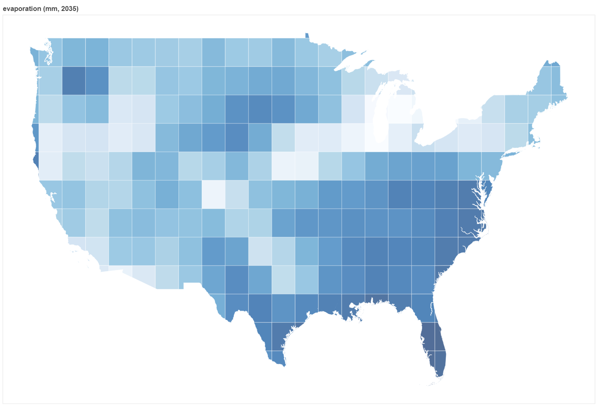

# SIMoN Visualization

SIMoN stores all of the data outputs from the models as documents in a Mongo database (the `simon_mongodb` container).

You can retrieve a document and save it as a JSON file using the `export.sh` bash script in the `viz` directory.

Once you've retrieved a document and saved it as a JSON file, plot the data on a choropleth map using the `plot.py` script in the `viz` directory. (Just make sure to pip install `requirements.txt` first.)

At each timestep, each model outputs its data for that timestep as a dictionary. The dictionary maps geographic IDs to values for the corresponding region. The particular IDs will depend on the geographic granularity. This dictionary is stored as a JSON document in the Mongo database (the `simon_mongodb` container). Since the data maps each region to a particular value, it can be easily visualized on a choropleth map.

You can retrieve a document and save it as a JSON file using the `export.sh` bash script in the `viz` directory.

```
cd viz/
./export.sh <model_name> <year>
```
For example,
```
./export.sh gfdl_cm3 2035
```

Once you've retrieved a document and saved it as a JSON file, plot the data on a choropleth map using the Python script in the `viz` directory. (Just make sure to install requirements first.)
```
pip install -r requirements.txt
python plot.py --data <your_mongo_doc>.json
```
For example,
```
python plot.py --data 2025_gfdl_cm3.json
```
A new HTML file will be created in the `viz` directory. Open this file in a web browser to display the Bokeh visualization.


